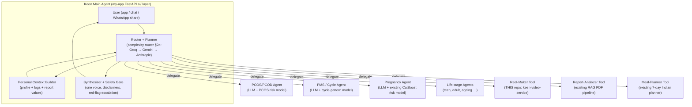

# Keen Agent Architecture — Keen as Main Agent, Personalized Sub-Agents per Section

> **Founder directive (Krishna Kant, 2026-07-12):** build a personalized
> model + LLM for PCOD/PCOS and PMS, make them excellent, and repeat the same
> pattern for **every section** of NutriMama. **All control goes to Keen**: the
> Keen backend decides first, and every model/LLM works as a **sub-agent**
> under Keen as the **main agent**.
>
> This document is the blueprint. The implementation lives in the NutriMama
> repo (`my-app`, Next.js + FastAPI `ai/` layer); it is specified here because
> this repo hosts the project's persistent memory (`KNOWLEDGE_GRAPH.md`) and
> because this video service becomes one of the sub-agents (§7).

---

## 1. Core principle: Keen decides first

No model or LLM ever answers the user directly. Every user interaction flows
through the **Keen Main Agent**, which:

1. **Understands** the request (intent + which section it belongs to),
2. **Decides** which sub-agent(s) to delegate to — or to answer itself, refuse,
   or escalate to a human expert,
3. **Delegates** with a personalized context package (§4),
4. **Synthesizes** sub-agent outputs into one voice (Hinglish-first),
5. **Gates** the final answer through safety rules (§8) before it reaches the
   user.

Sub-agents are specialists with no authority: they receive a task, return a
result, and never talk to the user, to external services, or to each other
except through Keen. This keeps one place to enforce cost caps, safety,
DPDP compliance, and product tone — exactly like `X-Keen-Key` + the daily
render cap already gate this video service.



---

## 2. What a "personalized model + LLM" sub-agent is

Every section sub-agent has the **same three layers**. This uniformity is the
whole point — building the PCOS agent creates the template; every later
section is a fill-in-the-blanks copy.

| Layer | What it is | PCOS example |
|---|---|---|
| **LLM layer** | An LLM chosen **per request by the complexity router (§2a)** — Groq, Gemini, or Anthropic — with a **section system prompt** (persona, scope, Hinglish tone, hard safety rules) + **LangChain RAG** over a section knowledge base (curated Indian-context docs, ICMR/FOGSI-style guidance, desi food tables) | "You are NutriMama's PCOS nutrition specialist… answer in Hinglish… never diagnose…" + RAG over PCOS-nutrition corpus |
| **Model layer** | A small classical ML model per section (the **CatBoost pattern** already proven by the maternal-risk model) that turns the user's structured data into scores/labels the LLM cannot compute reliably | PCOS symptom-risk scorer: cycle irregularity, BMI, reported symptoms, report values (insulin, testosterone, TSH) → Low/Medium/High + top contributing factors |
| **Personalization layer** | The context package Keen injects per request (§4): profile, life stage, cycle/symptom logs, extracted report values, diet preferences, past plan adherence | 24-year-old, vegetarian, tier-2 city, irregular cycles logged 3 months, fasting insulin from uploaded report |

The LLM makes it conversational and Indian-food-practical; the model makes it
*personal and consistent* (same inputs ⇒ same risk, auditable); Keen makes it
safe and coherent.

---

## 2a. LLM routing by complexity (founder directive, 2026-07-12)

Three provider API keys are available — **Gemini, Groq, and Anthropic** — and
Keen picks the LLM **per request, by task complexity**. The choice is made
once by Keen's router (control stays with Keen); sub-agents receive the chosen
client, they never pick a provider themselves.

| Tier | Provider & model | Use for | Why |
|---|---|---|---|
| **Fast** | Groq — `llama-3.3-70b-versatile` | Intent/section classification, query rewriting, simple factual lookups, keyword extraction (e.g. Pexels visual prompts — this video service already uses exactly this) | Near-zero cost, lowest latency; wrong answers are cheap to correct because Keen re-routes on low confidence |
| **Standard** | Gemini — `gemini-2.5-flash` | Default for section sub-agent answers: RAG-grounded PCOS/PMS/pregnancy responses, meal-plan generation, reel-script writing, Hinglish synthesis | Cheap, strong multilingual/Hinglish, already the app's LangChain default |
| **Complex** | Anthropic — `claude-opus-4-8` ($5 in / $25 out per MTok) | High-stakes reasoning: multi-section synthesis (PCOS + pregnancy + report values interacting), medical-report edge cases, red-flag adjudication in the safety gate, plan conflicts (allergy vs deficiency vs preference) | Strongest reasoning for medical-adjacent judgment calls, where a wrong answer costs trust or safety, not just tokens |

**How the router decides (rules first, cheap and auditable):**

1. **Red flags or safety-gate adjudication** → Complex (always — never economize
   on the safety path).
2. **≥ 2 sections implicated, or report values + symptoms must be reasoned
   about together** → Complex.
3. **Single-section question with RAG context available** → Standard.
4. **Classification / extraction / rewriting, ≤ ~1 short paragraph out** → Fast.
5. **Escalation ladder**: if a lower tier returns low confidence, contradicts
   the section's ML-model output, or fails validation, Keen re-runs the task
   one tier up (Fast → Standard → Complex). This mirrors the proven
   Groq → Gemini → heuristic fallback in this repo's `scene_mapper.py` and the
   edge-tts → ElevenLabs TTS chain: ordered chains with graceful degradation.
6. **Provider outage** = same ladder sideways: Standard work fails over
   Gemini → Groq (degraded) or Gemini → Anthropic (premium), per a
   `LLM_CHAIN`-style config, so no single provider outage takes NutriMama down.

**Cost guard (same philosophy as this service's 50-renders/day cap):** a daily
budget for the Complex tier — e.g. max N Anthropic calls/day, in-memory or
Redis counter — past which Complex-tier work degrades to Gemini with a logged
warning, except the safety path, which is exempt from the cap.

**Config:** `GEMINI_API_KEY`, `GROQ_API_KEY`, `ANTHROPIC_API_KEY` env vars in
the NutriMama backend (never in this repo — this service keeps only its
existing keys). Anthropic calls use the official `anthropic` Python SDK with
adaptive thinking left at defaults; keep `max_tokens` modest for chat-length
answers and stream anything long.

---

## 3. Section registry — the sub-agents to build

Priority order (wedge first, per the validation-over-code strategy):

| # | Sub-agent | Model layer | Status |
|---|---|---|---|
| 1 | **Pregnancy** | existing CatBoost maternal-risk | **Migrate first** — it already exists; wrapping it in the sub-agent contract (§5) *creates* the template with zero new ML work |
| 2 | **PCOS/PCOD** | PCOS symptom-risk scorer (train when labelled data exists; heuristic rules until then) | The directive's named target; second because it forces the cycle-data pipeline |
| 3 | **PMS / cycle & hormonal balance** | cycle-pattern model (phase prediction + symptom correlation) | Shares the cycle-log data with #2 |
| 4–9 | **Six life stages** (birth/childhood, growth, teen, young adult, adult wellness, healthy ageing) | start prompt+RAG only; add models when each stage has data | One per brand-poster stage |
| — | **Utility tools** (not personas): Reel-Maker (this repo), Report-Analyzer, Meal-Planner, Tracker | n/a | Already exist; register under the same contract |

"Every section that I make" ⇒ **adding a section = adding one registry entry +
one prompt file + one knowledge folder** (+ optionally one model). Nothing in
Keen's core changes.

---

## 4. The personal context package

Keen builds this **once per request** and passes it to whichever sub-agents it
delegates to — sub-agents never query the DB themselves (control stays with
Keen, and DPDP data-minimisation is enforced in one place: each agent receives
only the fields its registry entry declares).

```json
{
  "user": { "age": 24, "life_stage": "young_adult", "language": "hinglish",
            "diet": "vegetarian", "region": "UP", "goals": ["regular cycles"] },
  "section_data": {
    "cycle_logs": [ { "start": "2026-06-02", "length": 41, "symptoms": ["acne", "cramps"] } ],
    "report_values": { "fasting_insulin": 18.2, "tsh": 2.1, "source": "report_2026-05.pdf" }
  },
  "model_outputs": { "pcos_risk": { "label": "Medium", "top_factors": ["cycle_irregularity", "fasting_insulin"] } },
  "history_summary": "User asked about weight gain last week; was given a ragi-based breakfast plan."
}
```

Storage: existing PostgreSQL/Prisma. New tables needed: `cycle_logs`,
`symptom_logs`, `section_profiles` (per-section structured answers from a
one-time onboarding quiz). Report values already exist via the PDF analyzer.

---

## 5. The sub-agent contract

Every sub-agent — LLM persona, ML model, or external tool — is registered with
Keen using one shape, so the router can function-call any of them uniformly:

```json
{
  "name": "pcos_agent",
  "kind": "section",                     // "section" | "tool"
  "description": "Personalized PCOS/PCOD nutrition & lifestyle specialist",
  "triggers": ["pcos", "pcod", "irregular periods", "hirsutism", "insulin resistance"],
  "needs": ["user", "cycle_logs", "report_values"],   // context fields Keen may share
  "model": { "type": "catboost", "artifact": "ai/models/pcos_risk.cbm", "fallback": "rules" },
  "llm": { "prompt": "ai/agents/pcos/system.md", "rag_index": "ai/agents/pcos/kb/" },
  "safety": { "red_flags": ["severe pelvic pain", "no period > 90 days"], "always_disclaim": true }
}
```

Suggested layout in `my-app`:

```
ai/
  orchestrator/          # Keen main agent: router, planner, synthesizer, safety gate
    registry.json        # all sub-agent contracts
  agents/
    pregnancy/  pcos/  pms/  teen/  ...   # system.md + kb/ + model.py per section
  models/                # trained artifacts (.cbm etc.)
```

---

## 6. Orchestration flow (one request, end to end)

1. User: *"Mujhe PCOD hai aur weight badh raha hai, kya khaun?"*
2. **Router** (Gemini function-calling over `registry.json` triggers) →
   sections: `pcos_agent`, tool: `meal_planner`.
3. **Context Builder** assembles §4 package; runs the PCOS model → `Medium`.
4. **PCOS agent** (LLM + RAG + model output in context) returns structured
   advice: insulin-friendly desi swaps, movement guidance, what to track.
5. **Meal-planner tool** turns the advice constraints into a 7-day plan.
6. **Synthesizer** merges both into one Hinglish answer; **Safety gate**
   appends the informational-only disclaimer, checks red-flags (none),
   attaches a "consult a doctor if…" line.
7. Optionally, Keen decides to also call the **Reel-Maker** (§7) to render a
   shareable 30-second PCOS-diet reel from the same content.

Keen's decision points are steps 2, 6, and 7 — the sub-agents never chose
anything.

---

## 7. Where this repo fits: the Reel-Maker sub-agent

`keen-video-service` is **already sub-agent-shaped** — headless, single
capability, key-gated, cost-capped. Its registry entry:

```json
{
  "name": "reel_maker",
  "kind": "tool",
  "description": "Renders a 9:16 Hinglish captioned reel from a script",
  "endpoint": "POST https://keenhunter-keen-video-service.hf.space/api/v1/generate-video",
  "auth": "X-Keen-Key",
  "input": { "topic_or_script": "3-8000 chars", "voice_id": "hi-IN-SwaraNeural", "bgm_style": "none" },
  "async": { "poll": "GET /api/v1/status/{job_id}", "result": "output_url" },
  "limits": { "renders_per_day": 50 }
}
```

**No code changes are required in this repo for v1 of the architecture.** The
existing API contract already supports every section: the section sub-agent
writes the script (PCOS reel, teen-nutrition reel, ageing reel…), Keen calls
this service. Two later niceties (only when validation succeeds): durable MP4
storage (already KNOWLEDGE_GRAPH §8 next-step 2) and an optional
`section`/`tags` field on `VideoRequest` for analytics.

---

## 8. Safety & compliance (non-negotiable for health sections)

- **Informational only, never diagnostic** — every section answer carries the
  disclaimer; risk labels are framed as "patterns worth discussing with a
  doctor". This is the medical-liability line from the strategy notes.
- **Red-flag escalation**: each registry entry lists symptoms that make Keen
  bypass nutrition advice and say "please see a doctor now" (e.g. PCOS: no
  period > 90 days; pregnancy: bleeding, reduced fetal movement).
- **DPDP data minimisation**: sub-agents get only their declared `needs`
  fields; health data never leaves Keen's boundary except to the LLM API
  under the existing Gemini terms; nothing user-identifiable is ever sent to
  this video service (scripts must be generic content, no personal data).
- **One voice**: sub-agents return structured content; only the synthesizer
  writes to the user. Prevents contradictory advice between sections.

---

## 9. Phased rollout (respects "validation over code")

The current #1 priority is 10 real users / 5 nutritionists, **no new
features**. So:

- **Phase 0 (now, ~zero cost):** write this blueprint (done); wrap the
  *existing* pregnancy pipeline (CatBoost + RAG + concierge) behind the
  registry contract — pure refactor, no new features, makes the demo story
  "NutriMama is an agent team" without new surface area.
- **Phase 1 (after validation):** PCOS/PCOD + PMS agents, prompt + RAG +
  rules-based scorer; add cycle/symptom logging tables (this is the data
  moat — start collecting early).
- **Phase 2 (when logs exist):** train the per-section CatBoost models
  (PCOS risk, cycle patterns) on real logged data; personalization becomes
  genuinely per-user rather than per-segment.
- **Phase 3:** remaining life-stage agents, one at a time, each = registry
  entry + prompt + kb folder.

**Perfection path for PCOS/PMS ("make them perfect"):** curate the knowledge
base with a real nutritionist (the same 5 nutritionists targeted for
validation — their corrections become the eval set), keep a per-section eval
sheet of 30–50 real questions with expert-approved answers, and re-run it on
every prompt/model change.
