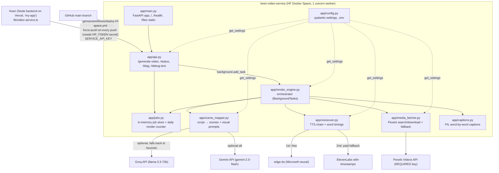

# Keen Video Service — Project Knowledge Graph

> **Purpose:** this file is the persistent memory of the project. A new Claude/dev
> session should read this first (it is linked from `CLAUDE.md`, which Claude Code
> auto-loads) and immediately understand the architecture, the history, the
> gotchas, and what to do next — without re-reading the whole codebase.
>
> **Rule: whenever you make a significant change (new module, new endpoint, new
> deploy step, a bug with a lesson, a decision), update this file in the same
> commit.** Update the "Current state & next steps" section every session.

**Last updated:** 2026-07-12 (validation-readiness build: durable MP4 outputs via
HF dataset repo, persistent render counter, smoke tests + CI, PCOD reel scripts)

---

## 1. What this project is (one paragraph)

A headless, asynchronous **video-generation microservice** (FastAPI, Python 3.10+).
**Keen** — a separate Node backend (the **NutriMama** app, deployed on Vercel as
`my-app`, integration code in `my-app/lib/video-service.ts`; see §10 for what
NutriMama is and why it matters) — POSTs a topic/script; this service renders a Lumen5-style 9:16 (1080×1920) reel with
stock footage (Pexels), a Hindi-first voiceover (edge-tts → ElevenLabs
fallback), and word-by-word highlighted captions, then serves the MP4 at
`/files/<job_id>.mp4`. Production home: **Hugging Face Docker Space
`KeenHunter/keen-video-service`** (`https://keenhunter-keen-video-service.hf.space`),
auto-deployed from GitHub `main`.

---

## 2. System graph (who talks to whom)

## 3. Render pipeline (data flow through one job)

```mermaid
flowchart LR
    A["script/topic"] --> B["map_scenes:<br/>sentence split (handles Devanagari '।')<br/>+ visual prompt per scene (LLM or heuristic)"]
    B --> C["generate_voiceover:<br/>narration = joined scene texts<br/>TTS_CHAIN tried in order → mp3 + WordTiming[]"]
    C --> D["caption-text guard:<br/>if provider words != narration.split()<br/>→ _estimate_word_timings from narration"]
    D --> E["_scene_spans:<br/>cuts land on sentence ends<br/>(word timings, not static 3s)"]
    E --> F["fetch_clip per scene:<br/>Pexels → broaden query → generic fallback<br/>→ None ⇒ solid ColorClip (never fails)"]
    F --> G["_fit_to_frame: cover-scale + centre-crop"]
    G --> H["build_caption_clips:<br/>PIL RGBA frames, active word highlighted yellow,<br/>script-aware font selection"]
    H --> I["_mix_bgm: optional ducked track<br/>assets/bgm/&lt;style&gt;.mp3 (missing ⇒ skip)"]
    I --> J["write_videofile: H.264 3500k AAC<br/>output/&lt;job_id&gt;.mp4 → output_url"]
```

Job states (`models.JobState`): `queued → mapping_scenes → generating_voiceover
→ fetching_media → rendering → done | failed`. Progress and messages are pushed
to `jobs.update_job` at each phase; `GET /api/v1/status/{job_id}` reads them.

---

## 4. Node index (files → responsibility → key symbols)

| File | Responsibility | Key symbols / notes |
|---|---|---|
| `app/main.py` | FastAPI entrypoint; mounts `/files` static dir; `/` landing page (HF Space would otherwise 404); `/health` with build marker | `health()` includes `"build"` string — bump it to verify a deploy actually shipped |
| `app/api.py` | HTTP layer. `POST /api/v1/generate-video` (202, auth, cost guard, enqueue), `GET /status/{id}`, `GET /diag` (key-gated ops probe: Pexels live test, font/raqm report, `?tts=1` TTS probe *costs ElevenLabs credits*, `?caption=1` Devanagari self-test), `GET /debug-text` (dumps narration vs provider words) | `_check_auth` = `X-Keen-Key` shared secret; empty `SERVICE_API_KEY` ⇒ open (dev) |
| `app/config.py` | All settings via pydantic-settings from `.env`/env | `tts_chain_list` (default `["edge","elevenlabs"]`), `public_url` (auto-detects HF `SPACE_HOST`), `max_renders_per_day=50` |
| `app/models.py` | Schemas | `VideoRequest` (`topic_or_script` 3–8000 chars, `voice_id` default `hi-IN-SwaraNeural`, `bgm_style` default `none`), `JobState`, `JobInfo` |
| `app/jobs.py` | Thread-safe **in-memory** job store + daily render counter (UTC-bucketed, **mirrored to `work/render_counter.json`** so restarts can't reset the spend ceiling; file I/O soft-fails) | `reserve_render_slot(limit)` (limit ≤ 0 = unlimited), `renders_today()`. Deliberately a tiny interface so it can swap to Celery+Redis later |
| `app/render_engine.py` | Orchestrates the whole job; the only place that touches MoviePy composition | `run_render_job`, `_scene_spans`, `_estimate_word_timings`, `_fit_to_frame`, `_mix_bgm`. Closes every clip in `finally` |
| `app/scene_mapper.py` | Sentence split (regex includes `।` for Hindi) → per-scene descriptive Pexels query via Groq→Gemini→keyword-heuristic | `map_scenes`, `Scene(index,text,visual_prompt,word_count)` |
| `app/voiceover.py` | TTS with word-level timings; providers tried in `TTS_CHAIN` order | `generate_voiceover`, `_edge_tts` (WordBoundary events, 100-ns ticks), `_elevenlabs_tts` (per-char alignment → `_chars_to_words`), `WordTiming` |
| `app/media_fetcher.py` | Pexels HD fetch: search → `_broaden` (drop trailing words) → generic fallbacks; 429 backoff (3 tries); best-file = smallest that covers target | `fetch_clip` returns `None` on total failure (engine substitutes solid colour) |
| `app/storage.py` | **Durable output uploads** (optional): finished MP4 → public HF *dataset* repo (`HF_OUTPUT_REPO` + `HF_TOKEN`), `output_url` becomes the resolve URL that survives Space restarts | `upload_output(path, job_id)` returns URL or `None`; soft-fail — never fails a render; repo auto-created (`exist_ok`) |
| `tests/test_smoke.py` | Smoke tests: Devanagari sentence split, timing estimation, script-aware fonts render visible pixels, auth gate (401), persisted counter survives "restart" | No network/credits/video-export; run `python -m pytest tests/ -q` |
| `.github/workflows/ci.yml` | Runs the smoke tests on every PR + push to `main` (installs `fonts-lohit-deva` so the Devanagari font test is real) | The only gate before deploy-hf-space.yml ships `main` to production |
| `docs/PCOD_REEL_SCRIPTS.md` | 5 render-ready Hinglish PCOD reel scripts (the GTM wedge content) + curl recipe + per-reel validation metrics | Content rules: myth-buster hooks, management-not-cure language, desi foods, 1 sentence = 1 scene |
| `app/captions.py` | PIL-rendered word-by-word captions, no ImageMagick. **Script-aware font selection**: Devanagari text → globbed Devanagari font; Latin text → DejaVu/Arial (Noto Devanagari lacks Latin glyphs!) | `build_caption_clips`, `_load_font(size, text)`, `_has_devanagari`, `_discover_devanagari_fonts` (globs, because distro filenames vary), 4 words/line, 0.6 s pause break, yellow active word |
| `Dockerfile` | python:3.12-slim + ffmpeg + fonts (dejavu, noto-core, **lohit-deva** as guaranteed Devanagari) + non-root UID 1000 (HF requirement); `CAPTION_FONT` env baked; 1 uvicorn worker | Secrets are NEVER baked — HF injects at runtime |
| `.github/workflows/deploy-hf-space.yml` | Every push to `main` force-pushes to the HF Space (source of truth = GitHub) | Needs repo secret `HF_TOKEN` (HF write token) |
| `README.md` | **Doubles as HF Space config** — the YAML frontmatter (`sdk: docker`, `app_port: 8000`) is required; don't delete it | |
| `DEPLOY_HF_SPACE.md` | Full HF deploy runbook (secrets table, Vercel env vars for Keen) | |
| `DEPLOY_CLOUDRUN.md` | Alternative Cloud Run guide (not the production path; needs billing) | |
| `.env.example` | Every env var documented; copy to `.env` locally | |
| `requirements.txt` | fastapi / uvicorn / pydantic / httpx / **edge-tts 7.2.8** / **moviepy ≥2.1,<3** / imageio-ffmpeg / Pillow / numpy | Version pins encode past breakage — see gotchas |
| `assets/bgm/` | Operator drops royalty-free `<style>.mp3`; repo ships none | |

---

## 5. Configuration graph (env → behaviour)

| Env var | Default | Effect |
|---|---|---|
| `PEXELS_API_KEY` | *(empty)* | **REQUIRED** — without it every scene is a solid-colour background (render still "succeeds"!) |
| `SERVICE_API_KEY` | *(empty)* | `X-Keen-Key` shared secret. Empty = open = anyone can burn credits. Must equal `VIDEO_SERVICE_KEY` on Vercel |
| `TTS_CHAIN` | *(empty ⇒ `edge,elevenlabs`)* | Ordered provider fallback. `TTS_PROVIDER` is deprecated back-compat |
| `EDGE_DEFAULT_VOICE` | `hi-IN-SwaraNeural` | Used when request `voice_id` empty |
| `ELEVENLABS_API_KEY` / `_VOICE_ID` / `_MODEL` | `o6qTxWUeRyzRYZyUNDVJ` / `eleven_flash_v2_5` | Paid fallback; model must support Hindi |
| `GROQ_API_KEY` / `GEMINI_API_KEY` | *(empty)* | Optional; richer visual prompts, else keyword heuristic |
| `MAX_RENDERS_PER_DAY` | `50` | Cost guard, HTTP 429 past cap; `0` = unlimited (dev only). Persisted to `work/render_counter.json` — survives process restarts (not a full Space rebuild) |
| `HF_OUTPUT_REPO` | *(empty)* | With `HF_TOKEN`: finished MP4s also upload to this **public HF dataset repo**; `output_url` = durable resolve URL (WhatsApp-safe). Empty ⇒ ephemeral `/files/` URL only |
| `HF_TOKEN` | *(empty)* | HF write token for the upload (add as a Space secret) |
| `PUBLIC_BASE_URL` | *(auto)* | Empty ⇒ `https://$SPACE_HOST` on HF, else localhost:8000 |
| `VIDEO_WIDTH×HEIGHT` / `FPS` | 1080×1920 / 30 | 9:16 reel; `PEXELS_ORIENTATION=portrait` should match |
| `CAPTION_FONT` | *(Docker: Noto Devanagari Bold)* | Honoured only when it matches the text's script |

---

## 6. Hard-won lessons (do NOT re-learn these)

Each of these cost a debugging round-trip (see git history). They constrain
future changes:

1. **MoviePy must be 2.x** (`moviepy>=2.1,<3`). 1.x fails to build on
   Python 3.11+ and the API differs (`with_effects`, `subclipped`,
   `with_duration`, `vfx.Resize/Crop/Loop`, `afx.AudioLoop`). Commit `a9d150d`.
2. **edge-tts must be ≥7.2.x** — 7.0.0 gets 403s (Sec-MS-GEC token fix).
   Separately, **edge-tts is often IP-blocked (403) on datacenter hosts** like
   HF Spaces — that's *why* the TTS fallback chain exists; on HF, renders
   usually land on ElevenLabs (paid), which is *why* the daily render cap exists.
3. **Devanagari caption "tofu" (☐☐☐) had THREE distinct causes**, fixed in layers:
   - Missing/wrong font in the image → Dockerfile installs `fonts-lohit-deva`
     (guaranteed path) + `fonts-noto-core`, and `captions.py` *globs* for fonts
     because distro filenames vary (commit `369cb25`).
   - **ElevenLabs' with-timestamps per-char alignment reconstructs into mangled
     word text for non-Latin scripts** (audio is fine, text isn't). Therefore
     caption TEXT always comes from the narration; provider timings are trusted
     only when their words exactly match `narration.split()` (edge-tts does),
     else `_estimate_word_timings` length-weights the narration over the audio
     duration (commits `85b38c4`, `3f50068`).
   - Noto Sans Devanagari **lacks Latin glyphs**, so English/Hinglish captions
     rendered as tofu with the Devanagari font → `_load_font` picks the
     candidate list by script of the actual text (commit `bc42a3d`).
4. **Not Vercel-hostable** — renders take minutes and need OS-level FFmpeg.
   HF Docker Space chosen over Cloud Run because Cloud Run needs a billing card
   and throttles background CPU.
5. **HF Spaces run containers as UID 1000** — Dockerfile creates the `user`
   account and chowns everything; writable dirs `output/` and `work/` must be
   owned by it.
6. **Every render costs money on HF** (ElevenLabs fallback) → cost guard
   defaults to 50/day even when the env var is forgotten (commit `146352e`).
7. **Failures are deliberately soft**: missing BGM track, failed Pexels search,
   missing footage → the render continues (solid background / no music) rather
   than failing the job. Only "no scenes" and "all TTS providers failed" abort.
8. **`/health` has a `"build"` marker string** — bump it when you need to prove
   a deploy actually reached the Space.
9. **Diag probes cost credits**: `/diag?tts=1` does a real ElevenLabs synth.

---

## 7. Known limitations / debt (v1 by design)

- **In-memory jobs + BackgroundTasks**: job status is lost on restart; one
  render at a time. Planned swap: Celery + Redis behind the existing `jobs.py`
  interface — API/engine layers unchanged.
- **Ephemeral disk on HF**: local MP4s vanish on Space restart. **Mitigated**
  when `HF_OUTPUT_REPO`+`HF_TOKEN` are set (durable HF dataset URL via
  `app/storage.py`); unset ⇒ old behaviour. Operator action: set both secrets
  on the Space.
- **HF free tier sleeps after ~48h idle**; first call after sleep may exceed
  Keen's 15 s enqueue timeout — hit `/health` to warm it.
- ~~No tests, no CI checks~~ **smoke tests + CI now exist**
  (`tests/test_smoke.py`, `.github/workflows/ci.yml`); `/diag` and
  `/debug-text` remain the live-Space verification tools. No end-to-end render
  test yet (needs network + credits).
- ~~Render counter resets on restart~~ **persisted** to
  `work/render_counter.json` (survives process restarts; a full Space rebuild
  still resets it — acceptable, it's a ceiling, not billing).

---

## 8. Current state & next steps  ← update this every session

**State (2026-07-12):** Deployed and functioning on the HF Space. The last work
cycles were: Hindi/Devanagari caption correctness (fonts + text sourcing),
ops/diag endpoints, and the daily cost cap (now defaulting to 50). `main` is the
source of truth; every push auto-deploys to the Space.

**Latest session:** knowledge graph + `CLAUDE.md` bootstrap created and merged
(PR #4); parent-project context (NutriMama, §10) folded in. **2026-07-12
correction (branch `claude/nutrimama-market-strategy-pbh3ee`):** §10 rewritten —
NutriMama is a *lifelong nutrition app for every female (birth to death, six
life stages, nutri-mama.in, DPDP-compliant)*, not pregnancy-only; the 9-month
churn risk is superseded. For this video service that means reel topics/scripts
will span all female life stages (teen hormonal health, ageing, etc.), not just
pregnancy — keep TTS/captions generic, don't bake pregnancy assumptions in.

**Strategic frame for prioritising work (from §10):** the founder's #1 priority
for the next ~30 days is **validation over code**. **Beachhead decision
(founder, 2026-07-12): PCOD/hormonal-balance is the FIRST go-to-market wedge**
(pregnancy stays a door in the product, but launch marketing leads with PCOD).
Validation target accordingly: ~10 real women with PCOD/hormonal concerns or
~5 dietitians/nutritionists using NutriMama. No new features until then. For
this service, that means: only do work that supports demo readiness,
shareability, or fixes bugs blocking real usage of reel generation — and the
first reels to support are **PCOD/hormonal-topic Hinglish reels** for
Instagram/WhatsApp.

**Session 2026-07-12 (validation-readiness build):** shipped the three gaps
that blocked validation — (1) **durable MP4 outputs** (`app/storage.py`,
optional `HF_OUTPUT_REPO`/`HF_TOKEN` → public HF dataset resolve URL, soft-fail),
(2) **persistent daily render counter** (`work/render_counter.json`),
(3) **smoke tests + CI** (`tests/test_smoke.py`, 16 tests, `.github/workflows/ci.yml`).
Plus `docs/PCOD_REEL_SCRIPTS.md` (5 render-ready Hinglish PCOD reels for the GTM
wedge). `/health` build marker bumped to `durable-outputs-persistent-counter`.

**Sensible next steps (pick up here):**
1. **Operator (Krishna): set `HF_OUTPUT_REPO` (e.g. `KeenHunter/keen-video-outputs`)
   and `HF_TOKEN` as secrets on the HF Space** — until then output links are
   still ephemeral. Then render one PCOD reel from `docs/PCOD_REEL_SCRIPTS.md`
   and confirm the durable URL opens in an incognito browser/WhatsApp.
2. Verify the live Space after deploy: `GET /health` (build marker should read
   `durable-outputs-persistent-counter`), `GET /diag?caption=1` with the key.
3. Render all 5 PCOD reels, post to Instagram/WhatsApp, measure per
   `docs/PCOD_REEL_SCRIPTS.md` — this IS the 30-day validation work.
4. Job durability / throughput: Celery + Redis swap behind `jobs.py` when volume
   demands it (NOT now — premature before validation).
5. Later: an end-to-end render test (needs network + a Pexels key in CI).

---

## 9. How to work on this repo (session bootstrap checklist)

1. Read this file (you just did) — skim §4 for the file you're touching and §6
   before changing TTS, captions, fonts, MoviePy code, or deploy config.
2. Local run: `pip install -r requirements.txt`, copy `.env.example` → `.env`
   (set `PEXELS_API_KEY`), `uvicorn app.main:app --port 8000`. Needs OS FFmpeg.
3. Quick API smoke: `POST /api/v1/generate-video` with a 2–3 sentence script,
   poll `status_url`, fetch the MP4 from `/files/`.
4. Deploys happen automatically on push to `main` (HF Space). Feature work goes
   on a branch + PR.
5. **Before you finish: update §8 (and any other touched section) of this file.**

---

## 10. Parent project context — Keen = NutriMama

This service exists to serve **NutriMama**, the founder's (Krishna Kant) app.
Knowing what NutriMama is tells you *why* this service is Hindi-first, 9:16,
cost-capped, and hosted free. Handoff captured 2026-07-12.

**What NutriMama is (REPOSITIONED 2026-07-12 — founder correction):**
AI-powered **lifelong nutrition-care app for every female — "From Birth to
Death"**, NOT a pregnancy-only/maternal-only app (earlier §10 text said
"maternal-health app"; the founder corrected this with the official brand
poster). Tagline: *"Complete Nutrition Care — Lifelong nutrition care for every
female. Every Stage. Every Need. Every Day."* Started as an MCA 2nd-sem project
(HBTU Kanpur), now treated as a startup. Domain: **nutri-mama.in**.

**Six life stages served:** Birth & Early Childhood → Childhood & Growth →
Teenage & Adolescence → Young Adult & Active Life → Adult Life & Wellness →
Mature Life & Healthy Ageing. Pregnancy/maternal features remain the strongest
wedge/entry point, but the product scope is the full female lifecycle
(this dissolves the old "9-month lifecycle → churn by design" risk: expansion
across stages IS the retention model).

**Feature pillars (per brand poster):** Personalized Nutrition Plans (per life
stage), Healthy Food Recommendations (Indian foods), Cycle & Hormonal Balance,
Track Your Health, Wellness & Lifestyle, Expert Guidance / Food & Nutrition
Education. Positioning badges: Made for India, **DPDP-compliant**, Hindi +
English support, works offline, no credit card needed, simple & easy to use.

Target users: Indian females across all ages, tier-2/3 cities,
**Hinglish-speaking**, underserved by premium apps (Mylo, Pregnancy+, iMumz —
who are also pregnancy-window-bound, which NutriMama now is not). ← This is why
this service's voice, captions, and fonts are Hindi/Devanagari/Hinglish-first —
that's the product's core audience, not an edge case.

**NutriMama tech stack (the "Keen" side):**
- Frontend: Next.js 15+, TypeScript, Tailwind CSS 4, Framer Motion, TanStack Query
- Backend: FastAPI (Python) alongside the Node/Next.js app; DB: PostgreSQL + Prisma
- Auth: Better Auth · Uploads: UploadThing
- AI: Google Gemini 2.5 Flash + LangChain RAG; ML: CatBoost maternal-risk model
- Folders: `app/` (routes), `components/`, `lib/` (incl. `lib/video-service.ts`
  → calls THIS service), `prisma/`, `ai/` (main.py, predictor.py,
  rag_pipeline.py, train.py)

**NutriMama core features (built):**
1. **Medical PDF Report Analyzer** — upload blood/medical report, RAG + Gemini
   extract values, CatBoost predicts maternal risk (Low/Medium/High). The main
   differentiator vs competitors.
2. **Week-specific 7-day Nutrition Planner** — Indian-diet focused (khichdi,
   sahjan, ragi…), pregnancy-week aware, nutrient-synergy logic (iron + Vit C).
3. **AI Health Concierge** — pregnancy health chatbot.

(An earlier v3.0 — React+Vite PWA / Flask / Groq Llama-3.3-70b — had gamified
streaks, Hinglish voice meal logging, fetal milestones as Indian food metaphors
(week 4 = khus khus → week 40 = kaddu), WhatsApp share cards, offline-first
PWA. Reference only; the Next.js/FastAPI rebuild is current.)

**Go-to-market & strategy (shapes what dev work is worth doing):**
- **Beachhead decision (founder, 2026-07-12): PCOD/hormonal-balance first.**
  Product keeps motive-based onboarding ("one platform, many doors" — user
  picks PCOD / pregnancy / etc. at login and sees only that content), but
  launch **marketing** leads with the PCOD/hormonal wedge: "upload your hormone
  report, understand it, fix your thali — Hinglish, desi diet, ₹99." Pregnancy
  is the second door, not the launch message. Rationale: monthly (not 9-month)
  problem → recurring engagement; 18–30 Instagram-native audience reachable
  B2C; far lower medical-liability surface than maternal-risk prediction; no
  strong Hinglish/desi-diet PCOS competitor; earliest lifecycle entry point =
  longest lifelong LTV.
- Positioning: a **focused tool** — "upload your report, understand it,
  get your weekly desi diet" — NOT a super-app. Can't out-feature funded
  competitors.
- Distribution: gynecologists were too hard as first gatekeepers → target
  **dietitians/nutritionists (incl. Instagram PCOS dietitians), ASHA workers,
  prenatal instructors** as early adopters/distributors. Community channels:
  Instagram PCOD/PCOS Hinglish content, college campuses (founder is at HBTU
  Kanpur — the target demographic is on campus), Mylo community, Reddit
  builder subs, Facebook mom groups.
- Pricing preference: **₹99 one-time** over subscriptions (Indian market).
- Known risks: unclear paying customer (B2C user vs B2B2C nutritionist vs
  hospital); zero distribution vs funded competitors; **medical liability** of
  risk predictions (must stay "informational only" or doctor-in-the-loop);
  ~~9-month user lifecycle → churn by design~~ **superseded by the lifelong
  repositioning above** — the new risk is the inverse: scope breadth ("every
  female, birth to death") vs the need for one sharp beachhead; **resolved
  2026-07-12: the beachhead is PCOD/hormonal** (see above), other doors are
  expansion/retention, not simultaneous launch targets. PCOD-specific caveats:
  the CatBoost model is maternal-risk-only — do NOT promise "risk prediction"
  for PCOD (start as report *explainer* + diet plan); and position as
  management/support, never "cure PCOD by diet".

**Current #1 priority (next 30 days, as of 2026-07-12): validation over code.**
Get ~10 real women with PCOD/hormonal concerns or ~5 dietitians/nutritionists
actually using the app and giving feedback. **No new features until then.**
Dev work should only support onboarding friction, shareability, demo
readiness, or bugs blocking real usage. For this video service specifically:
reels must render reliably for demos (first up: PCOD/hormonal Hinglish reels),
and shareable (durable) MP4 links matter more than throughput or architecture
work.
